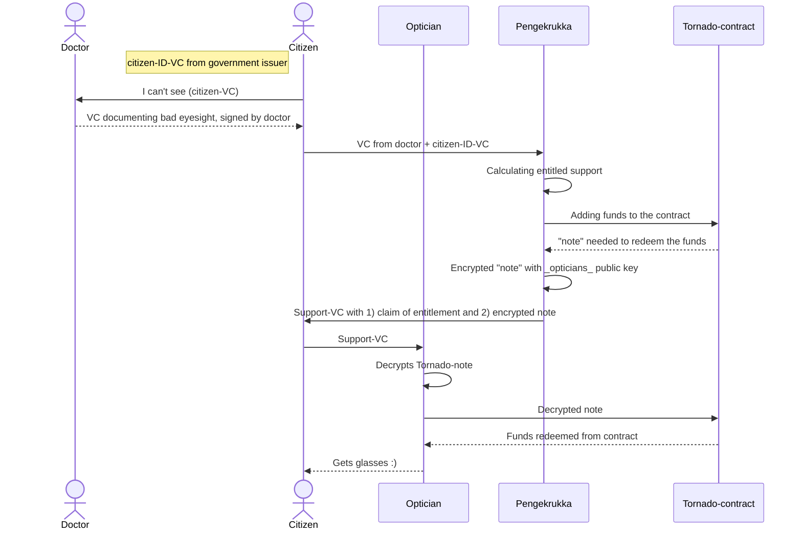

# Pengekrukka - Hackathon 
Pengekrukka (tongue in cheek name roughly translating to "Moneypot") is a Proof of Concept solution demonstrating an anonymous and decoupled transfer mechanism between the welfare state and an individual. It's implemented as part of a hackathon arranged by Norwegian Central Bank. The aim of the hackathon was to explore different opportunities, pitfalls and challenges offered by blockchain-based digital currency. 

[Utilizing Verifiable Credentials](https://www.w3.org/TR/vc-data-model-2.0/) (VC's) and [Zero Knowledge Proofs](https://en.wikipedia.org/wiki/Zero-knowledge_proof) (ZKP's) we're demonstrating how a government server can issue money to a citizen entitled to financial support for a specific service. In our case, this is financial support for buying glasses, e.g. due to low income or similar. This example is however completely arbitrary. 

We've attempted to show the flow of the system in the below sequence diagram. In short, the citizen receives a VC from the doctor claiming that s/he needs glasses. The citizen then provides this to the government, along with an assumed ID-VC and gets a government backed VC with a secret that, crucially, only a specific optician can use to redeem the allotted money. This made possible through [Asymmetric Encryption](https://en.wikipedia.org/wiki/Public-key_cryptography), encrypting the secret with the opticians public key. 

Most of our solution is off-chain. Smart contracts on the blockchain is simply used as a way to ensure that money is transferred where it is supposed to, in a trustless manner; the actors in this system need minimal to no information about each other, but can still trust that everything works as it should.

## Known Weaknesses 
- issuer of VC's not cryptographically validated (trivial to implement)
- have to choose service supplier (i.e. optician) beforehand
- a pure tornado cash implementation would lend itself to money laundring  
- anonymity is only as good as the anonymity set (i.e. the number of people using the system)
  - 1 deposit and 1 withdrawal creates a 1-1 mapping between the deposit and the withdrawal
- anonymity is based on same amount in and out for all deposits and withdrawals. This creates a constraint on the system
- probably lots more :) 

// TODO fix this(fill envs automatically)
## Local Development
- Start a local blockchain with `yarn contracts start`
- Extract ERC20 address and Tornado address from `DeployLocal.json` into `env.development`

## Testing 
- Strive towards adding tests when writing new features 
- Share code between tests when possible, but not at the cost of clarity 
- Run tests with `yarn <package> test`

## Working With Packages 
Every package is located under `./packages`. The monorepo is configured with [Yarn Workspaces](https://classic.yarnpkg.com/lang/en/docs/workspaces/). The setup intends you to interact with the packages from root level. To run a command in a package, simply run `yarn <package> <command>`, e.g. `yarn contracts test`. 

## Adding a New Package 
1. add a folder under `./packages`
2. add `./packages/<YOUR-PACKAGE>/package.json`-file with `{"name": "@pengekrukka/<YOUR-PACKAGE>", "version": "0.0.1", "private": true}`
3. add `"<YOUR-PACKAGE>": "yarn workspace @pengekrukka/<YOUR-PACKAGE>"` under `"scripts"` in (root) `./package.json`. 

## Environment 
Local development expects a `.env.development`-file at the root level. Use `.env.example` as a reference. 