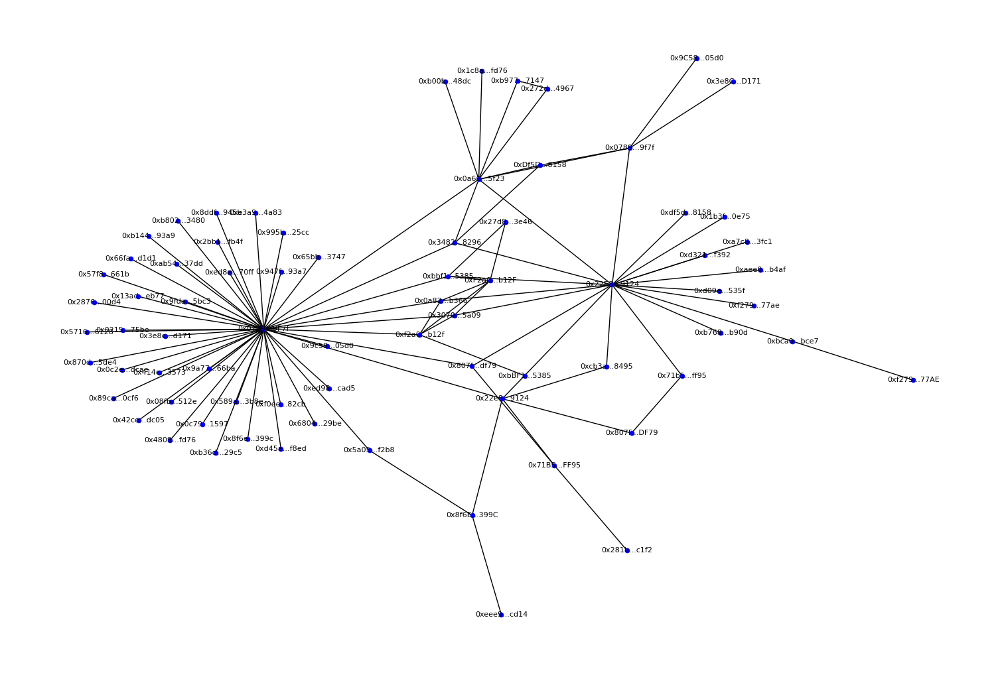
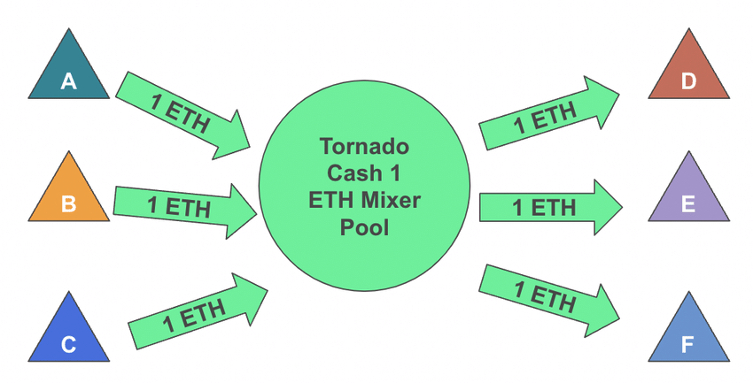

## Hei 👋

- Asbjørn Riddervold -> aridder@pm.me
- Olav Sundfør -> olav@sundfoer.com

--- 

## Pengekrukka 👓
- Utbetaling fra det offentlige 
- Digitale Sentralbankpenger -> Samfunnsnyttig
- Anonymt / Lav kobling
- Bygger på Verifiable Credentials og Zero Knowledge Proofs 

---
## Flyt 
 

---

## Tanker bak 1/3
- ivaretar personvern 🕵️
- både digital og fysisk 👵

 

---

## Tanker bak 2/3 
### Verifiable Credential
- Litt som en seddel (vannmerker -> digitale signaturer av utsteder)
- kun et standardisert JSON-objekt 
- kan like så gjerne være et fysisk ark med QR
- standardisert gjennom EUs ID-prosjekt 
- Forskning (Song et al 2022) peker paa dette som veien fremover

 

---

## Tanker bak 3/3 
### Zero Knowledge Proofs 
- kun gi den informasjonen som er relevant 
- har nøkkelen-bevise uten å vise det frem
- alt som havner på blokkjeden er anonymt gjennom ZKP

 

---

---

## Demo 🧑‍🚀
- heldigital, men det trenger den ikke være!

---

## Fordeler med denne løsningen 
- lav kobling mellom aktørene; vanskelig å sette sammen data 
- automatisk øremerket! ingen kvittering/bevisbyrde i etterkant
- generel løsning (skatt til gode, støtte fra Enova, elsykkel)

---

## Forbedringer og utfordringer
- implementert validering av VC-er 
- trenger ikke velge optiker hos Pengekrukka 
- tornado cash / hvitvasking 
- helt sikkert 100 ting til :) 

---

## Avslutningsvis 
- Gleder oss til etterpå 
- Takk for masse læring!
