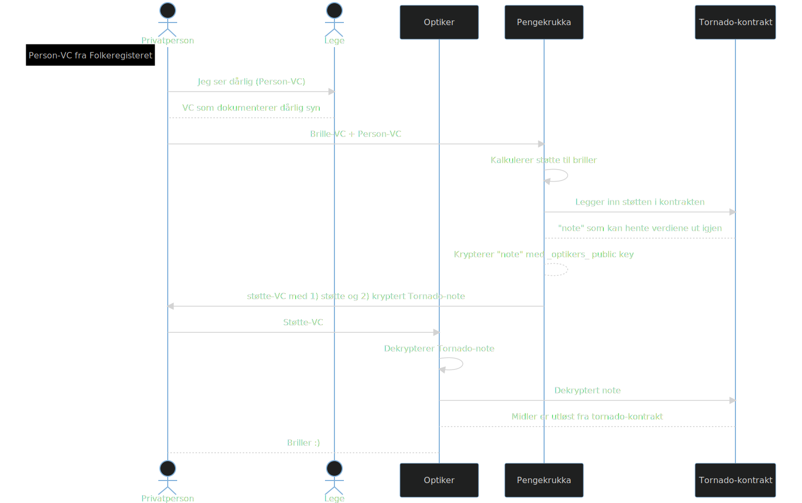

## Hei!
- Om oss
- Tekniske forklaringer 
- Oversikt over løsningen
- Demo!

--- 

## Om Oss 
- Asbjoern Riddervold 
- Olav Sundfør
- Lære! Og har lært.
- Samfunnsnyttige 

--- 

## Pengekrukka 
- utbetaling fra det offentlige 
- fokus på bevaring av personvern 
- bygger på Verifiable Credentials og Zero Knowledge Proofs  
- betalinger via blokkjeden

---
## Flyt 
 

---

## Tanker bak 1/3
- ivaretar personvern 
- både digital og fysisk 

 

---

## Tanker bak 2/3 
### Verifiable Credential
- Litt som en seddel (vannmerker -> digitale signaturer av utsteder)
- kun et standardisert JSON-objekt 
- kan like så gjerne være et fysisk ark med QR
- standardisert gjennom EUs ID-prosjekt 
- Forskning (Song et al 2022) peker paa dette som veien fremover

 

---

## Tanker bak 3/3 
### Zero Knowledge Proofs 
- kun gi den informasjonen som er relevant 
- har nøkkelen-bevise uten å vise det frem
- alt som havner på blokkjeden er anonymt gjennom ZKP

 

---

## Tilbake til Løsningen 

---

## Demo 🧑‍🚀
- heldigital, men det trenger den ikke være!

---

## Fordeler med denne løsningen 
- kan også fungere analogt!
- lav kobling mellom aktørene; vanskelig å sette sammen data 
- økt gjennomsiktighet uten å gå på bekostning av den enkeltes personvern 
- kan i prinsippet kjøres av hvem som helst i befolkningen
- automatisk øremerket! ingen kvittering/bevisbyrde i etterkant

---

## Ulempler med løsningen
- genering av proofs tar tid og koster mye gas
- fremmed for mange 
- helt sikkert 100 ting til :) 

---

## Ting som kunne gjort det kulere
- implementert validering av VC-er 
- anonymisere credentials gjennom hashing 
- trenger ikke velge optiker hos Pengekrukka 

---

## Avslutningsvis 
- Gleder oss til etterpå 
- Takk for masse læring!
- FJERN (lære mer i samtaler med dere)
- FJERN (vi ser faktisk etter flere prosjetker om dagen, så vi er åpne for den type samtler også)

---